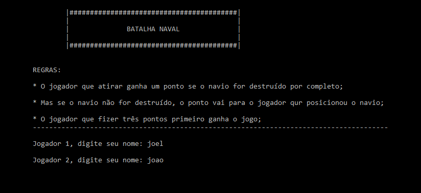

<h1 align="center">
  Batalha Naval
</h1>

 

  

 

## **Sobre o projeto**

#### Projeto prático para a disciplina de Programação estruturada e algoritmos II.

Jogo de batalha naval desenvolvido para aprimorar os conhecimentos em matrizes e vetores.

 

## **Demonstração**

O jogo começa explicando as regras e pedindo o nome de cada jogador. Depois, o jogador 1 é instruído a posicionar o seu navio no "campo de batalha".

 

  

 

Com o navio do primeiro jogador posicionado, é a vez do jogador 2 tentar destruir o navio do seu adversário.

 

  

 

## **Tecnologia utilizada**

